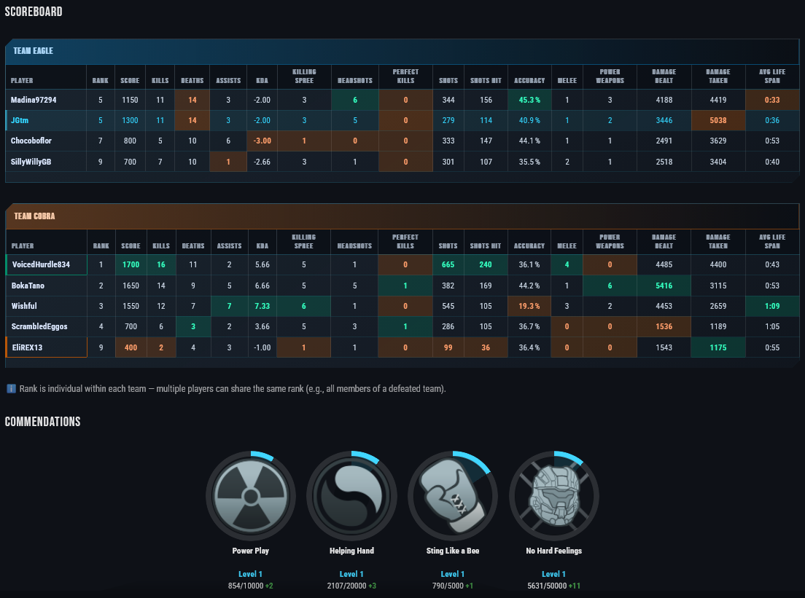

# LevelUp - Halo Infinite Dashboard

> **Analyze your Halo Infinite performance with advanced visualizations and an ultra-fast DuckDB v5 architecture.**

[](https://github.com/JGtm/LevelUp_with_SPNKr/releases/tag/v5.3.0)
[](https://www.python.org/downloads/)
[](https://streamlit.io/)
[](https://duckdb.org/)
[](https://pola.rs/)
[](https://opensource.org/licenses/MIT)

---

## What’s new

- **v5.3 — LUSR/CSR & i18n & Sessions**
  - TrueSkill 2 rating system per playlist group (ranked / arena / btb / tactical / social / fun)
  - Empirical calibration with historical data
  - Discord notifications after sync and backfill
  - Full internationalization (i18n) support across all UI pages
  - Multi-language interface (French 🇫🇷 / English 🇬🇧), switchable from the sidebar
  - Translations centralized in `src/ui/i18n/` (dedicated package: `common`, `pages`, `widgets`, `viz`, `cli`)
  - Career page: estimated pre-sync XP curve (purple dotted) + Hero rank projections (standard & optimistic with challenges + daily + ×2 boost, hidden by default)
  - **Solo / Squad session filter**: sidebar splits into two subsections — "Solo" (no friends) and "My squad" (at least one teammate from your selected squad), with persistent friend selection and vectorized Polars classification

- **v5.2 — PvE / Firefight**
  - Dedicated `shared_pve.duckdb` database for Firefight matches
  - Persistent intent-based filters
  - Full "Last match" scoreboard
  - Per-player OAuth tokens (player-gated Career Rank sync)
  - Okabe–Ito palette (color-blind friendly)

- **v5.1 — Optimized architecture**
  - Modern Streamlit (`@st.fragment`, `st.navigation`)
  - No SQLite / No Pandas, centralized `SyncScope`
  - −75% DB connection time

- **v5.0 — Shared Matches**
  - `shared_matches.duckdb` centralizes all matches (registry, participants, events, medals)
  - −69% storage, −72% API calls
  - **3323 tests**, 0 failures

---

## Features

### Advanced stats
- **Interactive dashboard** - Explore your stats in real time
- **Detailed charts** - K/D trend, accuracy, time alive, kill streaks
- **Map analysis** - Per-map performance with heatmaps
- **Teammates** - Stats with your friends (same team or opponents)
- **Play sessions** - Automatic session detection with performance metrics

### Visualizations
- **Radar charts** - Per-minute stats and overall performance
- **Heatmaps** - Win rate by day/time of week
- **Distributions** - Histograms for accuracy, kills, scores
- **Correlations** - Scatter plots (time alive vs kills)
- **Top weapons** - Weapon stats with headshot rate

### Pages & navigation
- **Last match** - Full scoreboard for your latest game, searchable by match ID
- **Match history** - Filterable and sortable match log
- **Session comparison** - Side-by-side analysis of two play sessions
- **Career progression** - Rank history, progression to Hero, LUSR rating per playlist group
- **Commendations** - Track your commendations with medal distributions and grids
- **Media library** - Index and browse clips/screenshots linked to their matches
- **Discord notifications** - Automatic alerts after sync and backfill operations

### v5.3 architecture — DuckDB Multi-DB
- **Shared Matches** — `shared_matches.duckdb` centralizes all matches (registry, participants, events, medals)
- **PvE Firefight** — `shared_pve.duckdb` isolates Firefight stats (waves, bosses, enemies by type)
- **Multi-DB ATTACH** — DuckDB `ATTACH` for seamless cross-DB reads
- **LUSR/CSR** — TrueSkill 2 ratings per group stored in `match_skill_rank` (player DB)
- **Performance** — DuckDB queries < 30ms (warm), native Polars DataFrames, materialized views

---

## Screenshots

### Overview


*Main dashboard: multi-page navigation and real-time interactive charts.*


*Advanced filters (type, playlist, mode, map,session/period), Time-to-First-Kill vs First Death distribution, and per-match performance score.*

---

### Performance & Combat

| KDA | Cumulative performance & trend |
|:-:|:-:|
|  |  |


*K/D ratio with trend, cumulative performance score, average lifespan and combat skills.*

---

### Distributions & Correlations

| Distributions | Correlations |
|:-:|:-:|
|  |  |

*Histograms for accuracy/kills/scores with means and medians — scatter plots (time alive vs kills, etc.).*

---

### Activity by day & time


*Win rate and activity heatmap by day of week and time slot.*

---

### Last match details

| Last match | Scoreboard |
|:-:|:-:|
|  |  |
| Impact & Dominance | Antagonists |
|  |  |

*Full scoreboard for your latest game (searchable by match ID) — and your most formidable rivals, MVP/LVP, scoreboard, commendations (Halo 5 inspired) grid and medal distributions.*

---

### Squad sessions & Teammates

| Squad overview | Session stats |
|:-:|:-:|
|  |  |
| **Teammates performance** | **Squad ranking** |
|  |  |

*Filter your sessions by squad: compare your stats when playing with friends and see how you and your teammates perform across shared matches.*

---

### Career progression, Ranks & Path to Hero

| Career | Ranks (LUSR/CSR) | Path to Hero |
|:-:|:-:|:-:|
|  |  |  |

*Rank history, progression to Hero, LUSR/CSR per playlist group*

---

### Media library & Commendations

| Media library | Commendations |
|:-:|:-:|
|  |  |

*Browse and search your clips and screenshots linked to their matches (still in beta) — track your commendations with medal grids and distributions.*

---

## Quick start

**Prerequisites**: Python 3.12+ recommended (3.10 minimum). Windows note: avoid Python 3.14 if you hit native crashes during `pytest`.

```bash
# Clone the repo
git clone https://github.com/JGtm/LevelUp_with_SPNKr.git
cd LevelUp_with_SPNKr

# Create a virtual environment
python -m venv .venv

# Activate (Windows)
.venv\Scripts\activate

# Activate (Linux/macOS)
source .venv/bin/activate

# Install dependencies
pip install -e .
```

**Detailed docs**: [docs/INSTALL.md](docs/INSTALL.md)

**French README (archived)**: [docs/FR/README.md](docs/FR/README.md)

---

## Configuration

### 1. Copy the environment file

```bash
cp .env.example .env.local
```

### 2. Configure Azure tokens

```env
SPNKR_AZURE_CLIENT_ID=your_client_id
SPNKR_AZURE_CLIENT_SECRET=your_secret
SPNKR_AZURE_REDIRECT_URI=https://localhost
SPNKR_OAUTH_REFRESH_TOKEN=your_refresh_token
```

### 3. Get your refresh token

```bash
python scripts/spnkr_get_refresh_token.py
```

**Detailed docs**: [docs/CONFIGURATION.md](docs/CONFIGURATION.md)

---

## Architecture

### Data layout (v5.3)

```
data/
├── warehouse/
│   ├── metadata.duckdb            # Shared reference data (maps, playlists, medals)
│   ├── shared_matches.duckdb      # All matches (registry, participants, events, medals)
│   └── shared_pve.duckdb          # PvE Firefight stats (pve_match_stats) — v5.2
├── players/                       # Per-player enrichments (~4 MB/player)
│   └── {gamertag}/
│       ├── stats.duckdb
│       │   ├── player_match_enrichment  # performance_score, session_id (ONLY match table)
│       │   ├── antagonists, match_citations, career_progression
│       │   └── match_skill_rank         # LUSR or CSR rating per match — v5.3
│       └── archive/               # Parquet archives
└── backups/                       # Parquet backups
```

### Main DuckDB tables

| Database | Table | Description |
|----------|-------|-------------|
| `shared_matches` | `match_registry` | Central registry (1 row per match) |
| `shared_matches` | `match_participants` | All player stats (31 cols, incl. MMR) |
| `shared_matches` | `medals_earned`, `highlight_events` | Medals and recorded highlight events |
| `shared_pve` | `pve_match_stats` | Firefight stats per player/match |
| player `stats` | `player_match_enrichment` | performance_score, session_id |
| player `stats` | `match_skill_rank` | LUSR/CSR rating per match |
| player `stats` | `mv_map_stats`, `mv_global_stats` | Materialized views |

**Technical docs**: [docs/ARCHITECTURE_V5.md](docs/ARCHITECTURE_V5.md)

---

## Documentation

| Document | Content |
|----------|---------|
| [INSTALL.md](docs/INSTALL.md) | Detailed installation guide |
| [CONFIGURATION.md](docs/CONFIGURATION.md) | Tokens and profiles configuration |
| [COMMANDS.md](docs/COMMANDS.md) | Common commands cheat sheet |
| [ARCHITECTURE_V5.md](docs/ARCHITECTURE_V5.md) | v5 architecture (shared matches) |
| [SYNC_GUIDE.md](docs/SYNC_GUIDE.md) | Sync guide |
| [BACKUP_RESTORE.md](docs/BACKUP_RESTORE.md) | Backup and restore |
| [TESTING_V5.md](docs/TESTING_V5.md) | v5 testing strategy |
| [FAQ.md](docs/FAQ.md) | Frequently asked questions |
| [COMMENDATIONS.md](docs/COMMENDATIONS.md) | Commendations system (architecture & usage) |
| [COMMENDATIONS_REFERENCE.md](docs/COMMENDATIONS_REFERENCE.md) | Full commendations reference |

French docs: [docs/FR/](docs/FR/)

Archived docs (not translated): [docs/archive/](docs/archive/)

---

## Contributing

Contributions are welcome! See [CONTRIBUTING.md](CONTRIBUTING.md) for guidelines.

---

## Tech stack

| Technology | Usage |
|------------|-------|
| **Python 3.12+** | Main language |
| **Streamlit** | UI |
| **DuckDB 1.4** | OLAP query engine |
| **Polars 1.38** | High-performance DataFrames |
| **PyArrow 23** | Data interoperability |
| **Pydantic v2** | Data validation |
| **Plotly** | Interactive charts |
| **SPNKr** | Halo Infinite API |

---

## Known limitations

- **Halo API**: Depends on SPNKr — some endpoints can be unstable or rate-limited. Weapon stats are not available via the API (verified 2026-02-02).

---

## License

This project is licensed under MIT. See [LICENSE](LICENSE) for details.

---

## Acknowledgements

- **Andy Curtis** ([acurtis166](https://github.com/acurtis166)) for [SPNKr](https://github.com/acurtis166/SPNKr)
- **Den Delimarsky** ([dend](https://github.com/dend)) for [Grunt](https://github.com/dend/grunt) and [OpenSpartan](https://github.com/OpenSpartan)

See also [ACKNOWLEDGMENTS.md](ACKNOWLEDGMENTS.md).

---

**Made with passion for the Halo community**
