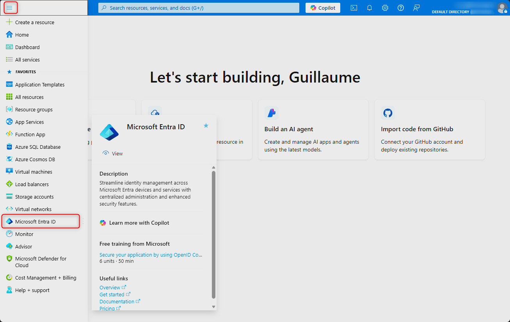
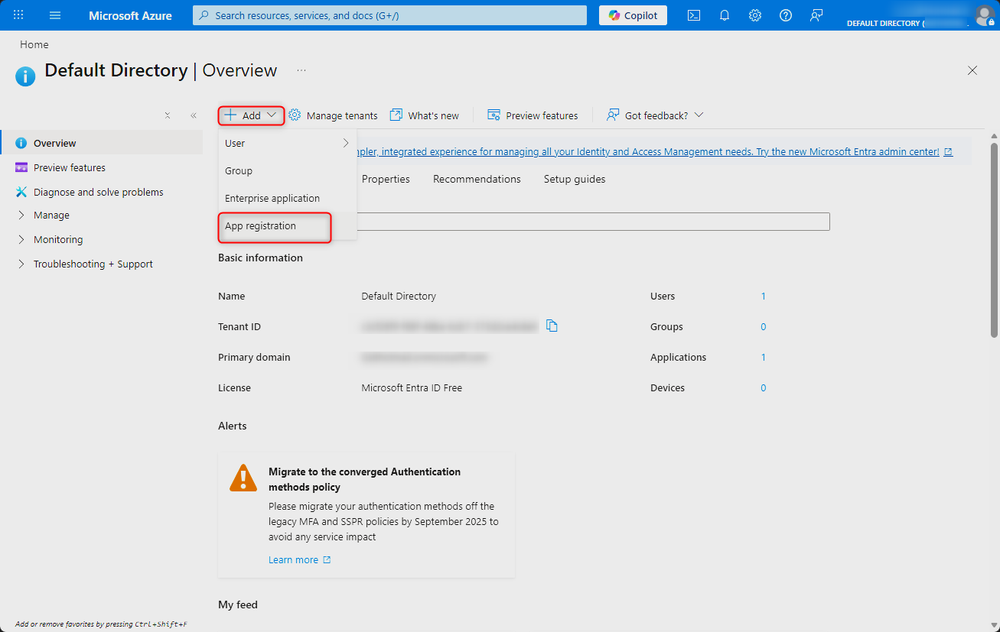
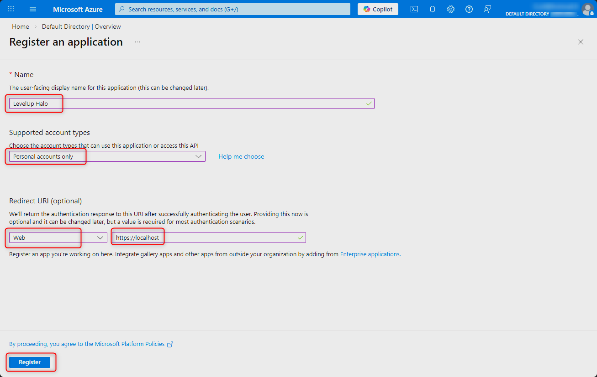
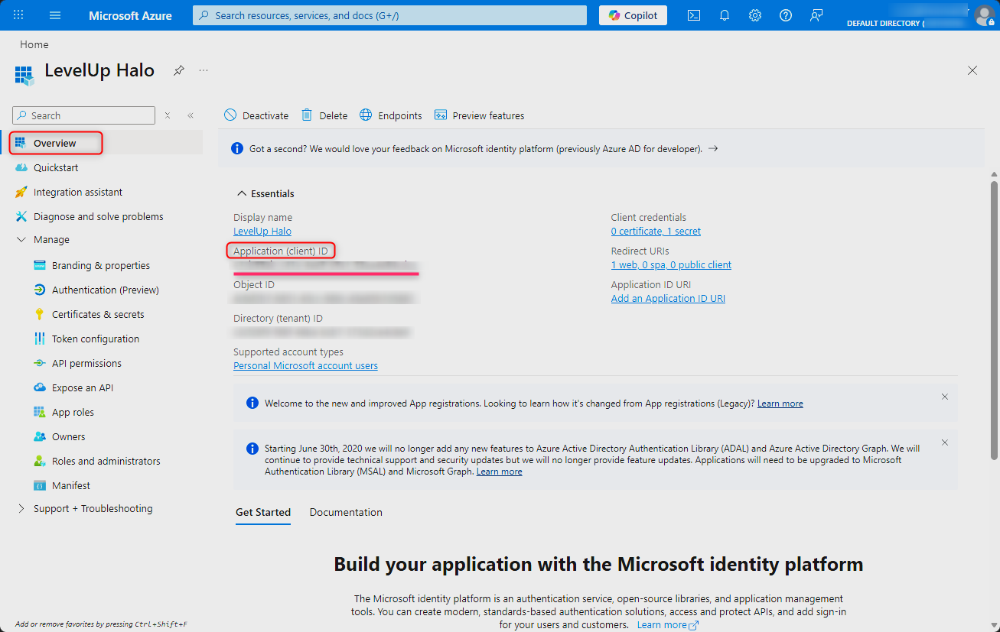

# Configuration Guide — LevelUp

French version: [FR/CONFIGURATION.md](FR/CONFIGURATION.md)

> Complete configuration guide: Azure tokens, player profiles, and application settings.

## Table of Contents

- [Setup Wizard (recommended)](#setup-wizard-recommended)
- [Azure Configuration](#azure-configuration)
- [Player Profiles](#player-profiles)
- [Environment Variables](#environment-variables)
- [Application Settings](#application-settings)
- [Security](#security)
- [Troubleshooting](#troubleshooting)

---

## Setup Wizard (recommended)

The easiest way to configure LevelUp is through the **Setup Wizard**, available automatically
on first launch in the browser at `http://localhost:8501`.

| | 🎮 Xbox Express | ☁️ Azure Manual |
|-|----------------|----------------|
| Azure application (Client ID only, no secret) | Required | Required |
| Refresh token | **Auto** (device code sign-in) | Manual (run script) |
| gamertag + XUID | **Auto** (resolved via OAuth) | Manual |
| Player profile in `db_profiles.json` | **Auto** (created by wizard) | Manual |
| Token storage | `stats.duckdb` (sync_meta) | `.env.local` |
| Steps in wizard | **2** | **3** |

**Xbox Express is the recommended path.** The only unavoidable step is creating a free
Azure application (Microsoft mandates this for the Halo Infinite API) — no client secret
or redirect URI required. See [INSTALL.md](INSTALL.md) for the illustrated walkthrough.

The manual steps below (§ Azure Configuration) describe the advanced / headless path.

---

## Azure Configuration

### About Azure Account Registration

> **Why does Azure ask for a credit/debit card?**
>
> Azure requires a credit or debit card during sign-up mainly for **identity verification and fraud prevention**. Even though many Azure services offer free credits or free tiers, Microsoft needs a valid payment method to:
> - Verify the user's identity
> - Prevent misuse or multiple free account sign-ups
> - Enable automatic billing if usage exceeds free limits
>
> **This does not mean charges will occur immediately.** Charges only apply if paid services are used beyond free limits.
>
> **For this project, you will never exceed the free tier.** LevelUp only registers an OAuth application in Azure Active Directory (Microsoft Entra ID), which is completely free and has no usage quota. No paid Azure service is consumed.

> **Azure for Students — No Credit Card Required**
>
> If you have a valid university or college email address, you can sign up for [Azure for Students](https://azure.microsoft.com/en-us/free/students/) for free, without a credit card.

### Prerequisites

To use the Halo Infinite API via SPNKr, you need:

1. A Microsoft/Xbox account
2. An application registered in Azure Portal
3. An OAuth refresh token

### 1. Create an Azure Application

1. Go to [Azure Portal](https://portal.azure.com/)
2. Navigate to **Microsoft Entra ID**

   

3. Click **Add** → **Add registration**

   

4. Configure:
   - **Name**: `LevelUp Halo`
   - **Supported account types**: Personal Microsoft accounts only
   - **Redirect URI**: leave empty
5. Click **Register**

   

6. After registration, you are redirected to the application's **Overview** page. **Copy the Application (client) ID** — this is your `SPNKR_AZURE_CLIENT_ID`.

   

   > It looks like: `xxxxxxxx-xxxx-xxxx-xxxx-xxxxxxxxxxxx` (GUID format)

### 2. Enable Device Code Flow (Public Client)

1. In your application, go to **Authentication**
2. Scroll down to **Advanced settings**
3. Set **Allow public client flows** to **Yes**
4. Click **Save**

> This is the only required setting beyond registration. No client secret, no redirect URI.

> **Recap — at this point you only need one value:**
> - `SPNKR_AZURE_CLIENT_ID` → copied from the app's **Overview** page (step 1.6)

### 3. Set Up the .env.local File (manual method — advanced)

> **If you used the Xbox Express wizard**, this file is created automatically — skip to
> [Player Profiles](#player-profiles).

```bash
# Copy the template (Linux/macOS)
cp .env.local.example .env.local

# Windows (PowerShell)
Copy-Item .env.local.example .env.local
```

Edit `.env.local`:

```env
# Azure Application (client ID only — no secret required)
SPNKR_AZURE_CLIENT_ID=xxxxxxxx-xxxx-xxxx-xxxx-xxxxxxxxxxxx

# OAuth token (obtained via the script below)
SPNKR_OAUTH_REFRESH_TOKEN=
```

### 4. Obtain the Refresh Token (manual method — advanced)

> **If you used the Xbox Express wizard**, the token was stored automatically in your
> player database (`stats.duckdb`, table `sync_meta`) — skip this step.

```bash
python scripts/spnkr_get_refresh_token.py --device-code
```

This script:
1. Displays a short code (e.g. `ABCD-1234`) and the URL `https://microsoft.com/devicelogin`
2. You visit the URL and enter the code in your browser
3. After sign-in, the refresh token is printed and saved to `.env.local` automatically

---

## Player Profiles

### File Structure (`db_profiles.json`)

> **If you used the Setup Wizard**, your first profile was created automatically.
> The information below covers adding more players or editing profiles manually.

LevelUp reads player profiles from `db_profiles.json` at the repo root.

```json
{
  "version": "2.1",
  "profiles": {
    "MyGamertag": {
      "xuid": "2533274823110022",
      "gamertag": "MyGamertag",
      "db_path": "data/players/MyGamertag/stats.duckdb",
      "is_default": true
    },
    "OtherPlayer": {
      "xuid": "2533274XXXXXXXXX",
      "gamertag": "OtherPlayer",
      "db_path": "data/players/OtherPlayer/stats.duckdb"
    }
  }
}
```

### Properties

| Property | Type | Description |
|----------|------|-------------|
| `xuid` | string | Unique Xbox identifier (16 digits) |
| `gamertag` | string | Player name |
| `db_path` | string | Path to the player's DuckDB database |
| `is_default` | boolean | Default player on app startup |

### Finding Your XUID

Several methods:

1. **Via the dashboard**: The XUID is displayed in settings
2. **Via the API**: During the first sync
3. **Via third-party sites**: xboxgamertag.com, etc.

### Adding a New Player

**Method 1 — Automatic via CLI (recommended):**

```bash
# By gamertag
python scripts/sync.py --add-player SpartanC

# By XUID
python scripts/sync.py --add-player 2533274823110022
```

This command:
- Resolves the gamertag/XUID via the API
- Creates the entry in `db_profiles.json`
- Creates the `data/players/<gamertag>/` folder

You can then run a first full sync right after:

```bash
python scripts/sync.py --add-player SpartanC --full --max-matches 500
```

**Method 2 — Manual:**

```bash
# Create the folder
mkdir -p data/players/NewPlayer

# Add the entry in db_profiles.json (see structure above)
# Then sync
python scripts/sync.py --player NewPlayer --full
```

---

## Environment Variables

### Configuration Files

| File | Usage | Git |
|------|-------|-----|
| `.env.local.example` | Template with default values | Versioned |
| `.env.local` | Local configuration (tokens) | Ignored |
| `.env` | Alternative to .env.local | Ignored |

### Available Variables

#### Azure / SPNKr

| Variable | Description | Required |
|----------|-------------|----------|
| `SPNKR_AZURE_CLIENT_ID` | Azure application ID (public client, no secret) | Yes |
| `SPNKR_OAUTH_REFRESH_TOKEN` | Global refresh token | Yes |
| `SPNKR_OAUTH_REFRESH_TOKEN_<GT>` | Per-player token (player-gated endpoints) | No |

> **Per-player tokens**: some Halo Waypoint endpoints (career rank, customization)
> return 403 if the Spartan token doesn't belong to the targeted player. To sync
> this data for multiple players, declare a per-player token in `.env.local`:
>
> ```env
> # Gamertag "SpartanC"   → normalized key SPARTANC
> SPNKR_OAUTH_REFRESH_TOKEN_SPARTANC=your_refresh_token
> # Gamertag "My GT 2"    → normalized key MY_GT_2
> SPNKR_OAUTH_REFRESH_TOKEN_MY_GT_2=another_refresh_token
> ```
>
> Normalization: `re.sub(r"[^A-Za-z0-9]", "_", gamertag.strip()).upper()`
>
> Without a per-player token, career rank sync is skipped (warning in logs)
> and the hero banner adornment won't display for that player.

#### Manual Tokens (Alternative)

If you don't want to set up Azure OAuth, you can provide Spartan and Clearance tokens manually:

| Variable | Description |
|----------|-------------|
| `SPNKR_SPARTAN_TOKEN` | Spartan auth token (short-lived) |
| `SPNKR_CLEARANCE_TOKEN` | Clearance token (short-lived) |

> These expire frequently and must be refreshed manually. The Azure OAuth flow
> (Option 2) is strongly recommended.

#### Application

| Variable | Description | Default |
|----------|-------------|---------|
| `LEVELUP_DB` | Path to the default DB | Auto |
| `LEVELUP_DB_PATH` | Alias for LEVELUP_DB | Auto |
| `LEVELUP_DB_READONLY` | Read-only mode | `0` |
| `SPNKR_PLAYER` | Default player for sync | First profile |

#### Debug

| Variable | Description | Default |
|----------|-------------|---------|
| `LEVELUP_DEBUG` | Global debug mode | `0` |
| `LEVELUP_DEBUG_ANTAGONISTS` | Debug antagonist calculations | `0` |
| `STREAMLIT_DEBUG` | Streamlit debug | `0` |

#### Uptime Monitor

| Variable | Description |
|----------|-------------|
| `TAILSCALE_FUNNEL_URL` | Public Tailscale Funnel URL for the Streamlit dashboard |
| `DISCORD_WEBHOOK_URL` | Discord webhook for uptime alerts |

---

## Application Settings

### File `app_settings.json`

Copy the template and customize:

```bash
cp app_settings.example.json app_settings.json
```

### Available Settings

#### Sync / SPNKr Refresh

| Setting | Type | Default | Description |
|---------|------|---------|-------------|
| `spnkr_refresh_on_start` | bool | `false` | Auto-sync on app startup |
| `spnkr_refresh_on_manual_refresh` | bool | `true` | Sync on manual refresh button |
| `spnkr_refresh_match_type` | string | `"matchmaking"` | Match type to sync (`matchmaking`, `custom`, `all`) |
| `spnkr_refresh_max_matches` | int | `500` | Max matches per sync |
| `spnkr_refresh_rps` | int | `3` | API requests per second (rate limit) |
| `spnkr_refresh_with_highlight_events` | bool | `true` | Fetch highlight events |
| `spnkr_refresh_with_backfill` | bool | `false` | Run backfill during sync |

#### Backfill Options (during sync)

| Setting | Type | Default | Description |
|---------|------|---------|-------------|
| `spnkr_refresh_backfill_medals` | bool | `false` | Backfill medals data |
| `spnkr_refresh_backfill_events` | bool | `false` | Backfill highlight events |
| `spnkr_refresh_backfill_skill` | bool | `false` | Backfill MMR/skill data |
| `spnkr_refresh_backfill_personal_scores` | bool | `false` | Backfill personal scores |
| `spnkr_refresh_backfill_performance_scores` | bool | `true` | Calculate performance scores |
| `spnkr_refresh_backfill_aliases` | bool | `false` | Backfill XUID→gamertag aliases |
| `spnkr_refresh_backfill_lusr` | bool | `true` | Backfill LUSR skill rating |

#### Profile & Assets

| Setting | Type | Default | Description |
|---------|------|---------|-------------|
| `profile_api_enabled` | bool | `true` | Enable profile API (career rank, etc.) |
| `profile_api_auto_refresh_hours` | int | `48` | Hours between auto-refreshes |
| `profile_assets_download_enabled` | bool | `true` | Download profile images (emblem, banner...) |
| `profile_assets_auto_refresh_hours` | int | `24` | Hours between asset re-downloads |

#### Media (Xbox Captures)

| Setting | Type | Default | Description |
|---------|------|---------|-------------|
| `media_enabled` | bool | `false` | Enable media integration |
| `media_captures_base_dir` | string | `""` | Path to Xbox captures folder |
| `media_tolerance_minutes` | int | `1` | Tolerance window for matching captures to games |

#### Localization

| Setting | Type | Default | Description |
|---------|------|---------|-------------|
| `lang` | string | `"fr"` | UI language (`fr`, `en`) |
| `discord_lang` | string | `"fr"` | Discord notification language |
| `cli_lang` | string | `"fr"` | CLI output language |

#### Discord Notifications

| Setting | Type | Default | Description |
|---------|------|---------|-------------|
| `discord_notifications_enabled` | bool | `false` | Enable Discord sync notifications |
| `discord_webhook_url` | string | `""` | Discord webhook URL |

#### Advanced

| Setting | Type | Default | Description |
|---------|------|---------|-------------|
| `tailscale_funnel_enabled` | bool | `false` | Enable Tailscale Funnel remote access |
| `doppler_enabled` | bool | `false` | Use Doppler for secrets management |
| `doppler_project` | string | `"levelup"` | Doppler project name |
| `doppler_config` | string | `"dev"` | Doppler config environment |
| `repository_mode` | string | `"duckdb"` | Data backend (always `duckdb`) |
| `enable_duckdb_analytics` | bool | `true` | Enable DuckDB analytics features |

### Streamlit Config (`.streamlit/config.toml`)

```toml
[server]
port = 8501
headless = true

[theme]
primaryColor = "#00A2E8"
backgroundColor = "#0D1117"
secondaryBackgroundColor = "#161B22"
textColor = "#C9D1D9"
font = "sans serif"

[browser]
gatherUsageStats = false
```

---

## Security

### Never Commit These Files

The following files must **never** be committed:

- `.env.local` / `.env`
- Any file containing tokens
- `credentials.json`

They are already listed in `.gitignore`.

### Token Rotation

Azure refresh tokens expire after 90 days of inactivity. To renew:

```bash
python scripts/spnkr_get_refresh_token.py --device-code
```

### Production Mode

In production (Docker, server):

```env
LEVELUP_DB_READONLY=1
```

This prevents accidental database modifications.

---

## Troubleshooting

### Expired Token

```
Error: invalid_grant
```

**Solution**: Regenerate the refresh token:
```bash
python scripts/spnkr_get_refresh_token.py --device-code
```

### Invalid Client ID

```
Error: unauthorized_client / bad_client_id
```

**Solution**: Check the Client ID in Azure Portal (Overview page). Make sure **Allow public client flows** is set to **Yes** in Authentication.

### Device Code Expired

```
Error: timeout — code expired
```

**Solution**: The code is valid for 15 minutes. Re-run the script and complete sign-in promptly.

### Database Not Found

```
Error: Database file not found
```

**Solution**: Check the path in `db_profiles.json` and create the folder:
```bash
mkdir -p data/players/MyGamertag
```

### Career Rank 403

```
Warning: Skipping career rank for PlayerX (no per-player token)
```

**Solution**: Add a per-player token in `.env.local` (see [Per-player tokens](#azure--spnkr)).
