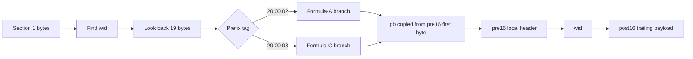
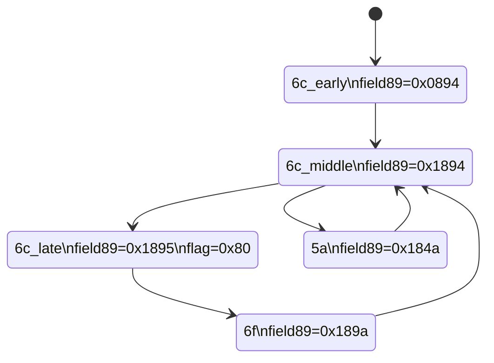
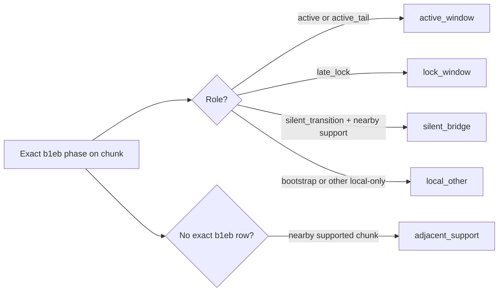
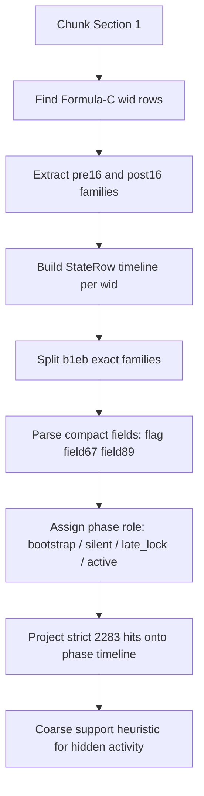
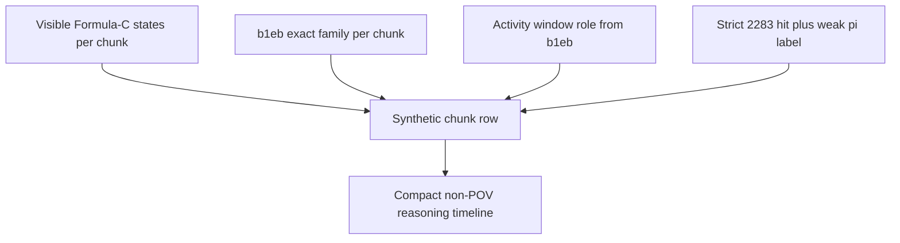
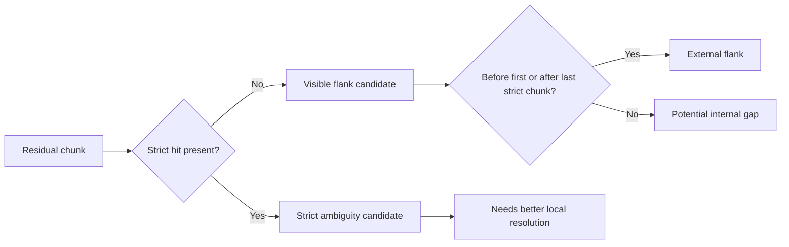
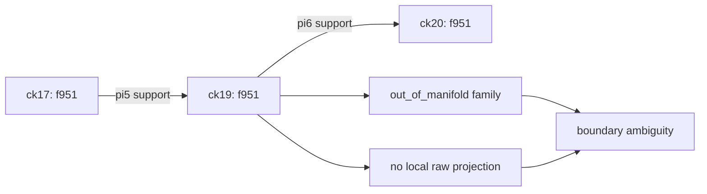

# Formula-C Technical Model

Last updated: 2026-03-08
Scope: local Section 1 decoding on 00162144, with focus on the Formula-C branch and the b1eb phase subsystem.

## Purpose

This note is not a narrative summary. It is the current working technical model with:

- explicit data structures;
- decoding assumptions;
- observed invariants;
- operational heuristics;
- schema diagrams for the current reverse-engineering state.

## Scope Boundaries

- Covered: Section 1 local records, Formula-A / Formula-C prefix bridge, b1eb phase model, strict 2283 hits.
- Not covered: literal all-lobby fire events, final gameplay semantics, any claim of complete player attribution for all Formula-C families.
- Main target match: 00162144.

## Data Model

### Local Section 1 Record

At the current confidence level, the minimal local object is:

| Field | Size | Current meaning | Status |
|---|---:|---|---|
| prefix_tag | 3B | 20 00 02 or 20 00 03 | observed |
| pb | 1B | bridge byte copied from pre16[0] | strong invariant |
| pre16 | 16B | local record header/state family | observed |
| wid | 8B | weapon/state id | observed |
| post16 | 16B | trailing local family payload | observed |

### Minimal Parse Objects

| Object | Fields | Meaning |
|---|---|---|
| StateRow | chunk_index, weapon_name, state_hex, pre16 | one Formula-C local state occurrence |
| ParsedB1eb | chunk_index, family_label, state_byte, flag_byte, field67_le, field89_le, tail_le, phase_role | one b1eb occurrence projected onto a phase role |
| ParsedHit | chunk_index, component_index, rule_name, offset, weapon_hex | one strict 2283 component hit |

## Structural Invariants

| Invariant | Statement | Evidence level |
|---|---|---|
| Prefix bridge | pb == pre16[0] | strong |
| Stable offset | prefix -> wid delta = -19 | strong |
| Branch separation | Formula-C states live outside current Formula-A state manifold | strong |
| b1eb phase field | field89 follows ordered progression | strong |
| Late lock marker | only 6c_late flips flag_byte to 0x80 and clears field67 high bit | strong |

## External Corroboration

Recent public discussion in the dend blog comments materially supports several parts of the current model.

### Corroborated Points

| External point | Impact on current work |
|---|---|
| player index should be read from the chunk bitstream, not assumed from stats ordering | aligns with current chunk-first indexing approach |
| the player XUID -> index mapping is not necessarily byte-aligned; read the 5 bits before the XUID | matches the current bitstring/XUID method already adopted |
| fire events are only reliably present for the recording player | strongly corroborates the current POV-only fire-event conclusion |
| the fire-event lead byte only has stable low bits, not a fully fixed byte value | supports the relaxed marker logic already used in the current fire parser |
| BR75 and MA40 can emit dual-stream duplicates with the same fire_counter | matches the existing dedup rule by weapon_id plus fire_counter |
| shot counter resets and post-match shots can exist in film data | supports known validation mismatches versus match stats |
| many weapon ids listed publicly match the current working registry | useful external confirmation of the weapon-id table |

### Not Directly Solved By That Discussion

| Still local to this investigation | Why external discussion does not close it |
|---|---|
| Formula-C branch on 00162144 | no public discussion there about the 20 00 03 branch |
| b1eb phase model | no matching public field-level analysis |
| f951 chunk 19 boundary ambiguity | no public signal about this local out-of-manifold family |
| hidden non-POV subsystem reconstruction from Section 1 | public discussion focuses mainly on POV fire events and motion parsing |

### Practical Reading

The external thread is best used as:

1. independent confirmation that the current fire-event and player-index foundations are sound;
2. extra confidence in the weapon-id table and dual-stream interpretation;
3. evidence that the remaining hard problems here are genuinely beyond the currently public write-ups.

## Prefix Structure

### Formula-A vs Formula-C

| Branch | Prefix | What is exposed today |
|---|---|---|
| Formula-A | 20 00 02 [pb] | visible player-side information through existing train-set heuristics |
| Formula-C | 20 00 03 [pb] | separate local state space; no direct reuse of Formula-A state manifold |

## b1eb Phase Subsystem

### Exact Families

| Family | Chunk set | Current role | field89 | flag | field67 |
|---|---|---|---|---|---|
| 6c_early | 1 | bootstrap | 0x0894 | 0x00 | 0x8271 |
| 6c_middle | 11, 17 | silent_transition | 0x1894 | 0x00 | 0x8271 |
| 6c_late | 18, 20 | late_lock | 0x1895 | 0x80 | 0x0272 |
| 6f | 6, 9, 10, 13, 17, 21 | active / active_tail | 0x189a | 0x00 | 0x8274 |
| 5a | 11, 15 | reset_or_silent_branch | 0x184a | 0x00 | 0x824c |

### Phase Graph

### Field Semantics Assumptions

| Field | Working assumption | Why | Confidence |
|---|---|---|---|
| field89_le | phase rank / local progression counter | clean ordered progression across staged families | medium-high |
| flag_byte | late commit / lock marker | only flips on 6c_late | high |
| field67_le high bit | coupled lock-state bit | changes only with late_lock | medium-high |
| 5a branch | reset or silent side branch | distinct field signature, out-of-band from 6c/6f chain | medium |

## Current Technical Heuristic

The current operational use of b1eb is not “decode final gameplay meaning”.
It is:

1. detect whether the local Formula-C subsystem is in an active, silent, or lock phase;
2. project other local signals onto that phase timeline;
3. use the phase as a coarse support signal for hidden/non-POV activity reconstruction.

## Activity Window Taxonomy

The phase model now supports a second layer: chunk-level activity windows.

| Window type | Rule | Interpretation |
|---|---|---|
| active_window | exact b1eb role contains active or active_tail | subsystem visibly active |
| lock_window | exact b1eb role contains late_lock | subsystem in late commit / lock phase |
| silent_bridge | exact role is silent_transition and supported phases exist nearby | silent bridge between supported windows |
| adjacent_support | no exact b1eb row on chunk, but immediate support exists nearby | weakly supported chunk |
| local_other | local exact row exists, but does not indicate active/lock support | bootstrap or unsupported local state |

### Current 00162144 Window Readout

| Window | Chunks | Meaning |
|---|---|---|
| local_other | 1 | bootstrap |
| active_window | 6 | first exact active signal |
| active_window | 9-10 | active cluster |
| silent_bridge | 11 | silent transition between supported phases |
| active_window | 13 | active singleton |
| silent_bridge | 15 | silent pi5 bridge, includes strict 831d hit |
| active_window | 17 | active tail with mixed local state |
| lock_window | 18-20 | late lock / commit plateau |
| active_window | 21 | active tail after lock plateau |

## Inference Pipeline

## Synthetic Timeline View

The current reference view is now a chunk-level synthetic timeline that merges:

- visible Formula-C states;
- b1eb family and phase role;
- Formula-C activity window role;
- strict unknown hits with weak pi labels.

### Current Reading Heuristic

| Pattern in synthetic row | Working interpretation |
|---|---|
| active_window + direct_raw_projection | strongest local support |
| lock_window + strict hit | late committed activity |
| silent_bridge + strict hit | activity crossing a silent transitional chunk |
| adjacent_support + phase_fallback | weak but still structured support |
| uncovered visible states | still-unexplained local state outside current b1eb support model |

## Reconstruction Layer

The model is now transformed into a chunk-level non-POV reconstruction layer.

This layer does not claim literal fire events. It produces a safer object:

- probable local context by chunk (`pi5`, `pi6`, `pi5_or_pi6`);
- explicit visible flanks left unattributed;
- compact segments for downstream reasoning.

### Reconstruction Labels

| Label | Meaning |
|---|---|
| pi5 / pi6 | reconstructed local context supported directly or by safe bridging |
| pi5_or_pi6 | local boundary chunk between conflicting supported contexts |
| visible_flank_unattributed | visible Formula-C flank kept explicit but not forced onto a player context |
| bootstrap_only | local b1eb bootstrap without attributable non-POV context |

### Current Segment Output on 00162144

| Chunk span | Label | Confidence | Basis |
|---|---|---|---|
| 01 | bootstrap_only | context | local_phase_only |
| 03 | visible_flank_unattributed | context | visible_outside_strict_envelope |
| 04-06 | pi6 | low | forward_supported_extension |
| 07 | pi6 | strong | direct_raw_projection |
| 08 | pi6 | moderate | phase_fallback |
| 09-10 | pi6 | strong | direct_raw_projection |
| 11-12 | pi6 | moderate | bridged_same_pi |
| 13 | pi6 | strong | direct_raw_projection |
| 14 | pi5_or_pi6 | boundary | between_conflicting_pi_contexts |
| 15-16 | pi5 | strong | direct_raw_projection |
| 17 | pi5 | moderate | phase_fallback |
| 18 | pi5 | strong | direct_raw_projection |
| 19 | pi5_or_pi6 | boundary | between_conflicting_pi_contexts |
| 20-21 | pi6 | strong | direct_raw_projection / phase_fallback |
| 23 | visible_flank_unattributed | context | visible_outside_strict_envelope |

### Reading Rule

The reconstruction should be used as:

1. a chunk-level context map for hidden/non-POV activity;
2. a safer replacement for the earlier purely qualitative Formula-C timeline;
3. an intermediate object before any future finer signal or player-level export.

## Export Layer

The reconstruction now has a stable serialization layer for downstream use.

### inv104 Outputs

| Format | Path pattern | Content |
|---|---|---|
| JSON bundle | `scripts/experimental/outputs/inv100_formula_c_non_pov_reconstruction.json` | metadata, label counts, confidence counts, chunk assignments, segments |
| CSV | `scripts/experimental/outputs/inv100_formula_c_non_pov_reconstruction.csv` | flat chunk-level table |
| JSONL | `scripts/experimental/outputs/inv100_formula_c_non_pov_reconstruction.jsonl` | one chunk assignment per line |

### Current Bundle Readout

| Key | Value |
|---|---|
| target_match | `00162144` |
| exported_chunks | 21 |
| exported_segments | 16 |
| dominant labels | `pi6=12`, `pi5=4`, `pi5_or_pi6=2` |

### Stable Path

`inv69` cache fallback -> `inv94` windows -> `inv100` reconstruction -> `inv104` serialization

## Known Limits

| Limit | Consequence |
|---|---|
| Chunk index is only a coarse time axis | phase projection is approximate, not frame-accurate |
| Formula-C is only confirmed on 00162144 | transferability is still unproven |
| Strict 2283 parser is conservative and sparse | absence of a hit is not absence of local activity |
| No literal all-lobby fire events | this remains a proxy model, not a direct fire-event extractor |

## Residual Taxonomy

The residual space is now split into two distinct categories.

| Residual type | Current example | Meaning |
|---|---|---|
| uncovered visible flank | ck03, ck23 | visible Formula-C states outside the strict timeline envelope |
| unresolved strict ambiguity | f951 at ck19 | strict hit exists, but no local raw projection resolves pi cleanly |

### Current Resolution State

| Chunk | Status |
|---|---|
| 03 | pre_strict_flank |
| 19 | boundary ambiguity on out-of-manifold f951 |
| 23 | post_strict_flank |

### f951 Chunk 19

Current best reading for `f951` on `ck19`:

| Property | Reading |
|---|---|
| family model | out_of_manifold |
| strict label | ambiguous |
| local window | adjacent_support |
| neighboring supported chunks | `ck17 -> pi5`, `ck20 -> pi6` |
| frame-level chunk structure | normal vs `ck17/18/20` |
| current diagnosis | boundary ambiguity, not random failure |

### Closed Hypothesis

The simple "chunk 19 is weird because the frame structure breaks there" hypothesis is now closed.

| Metric | ck17 | ck18 | ck19 | ck20 |
|---|---:|---:|---:|---:|
| frame_count | 862 | 880 | 896 | 851 |
| section2_size | 324224 | 341152 | 329736 | 330440 |
| avg_frame_size | 376.1 | 387.7 | 368.0 | 388.3 |

Interpretation: `ck19` is frame-normal relative to its neighbors, so the remaining ambiguity is not explained by a simple frame-density or chunk-size anomaly.

## Decision Rules

Use the model when all conditions hold:

- wid belongs to the confirmed Formula-C local set;
- the local family matches a known exact state;
- the inference only needs a coarse subsystem phase, not a frame-perfect event.

Do not use the model as if it proved:

- exact player identity from b1eb alone;
- exact shot timing;
- universal transfer to matches outside 00162144.
